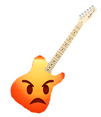
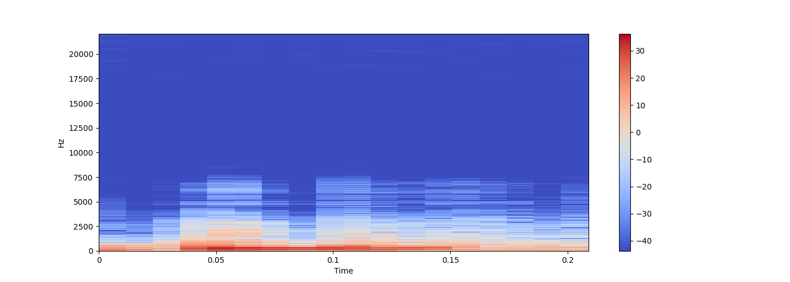
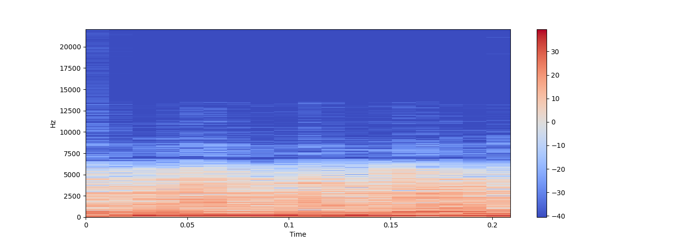

<p align="center">
  <a>
    
    <h1 align="center">Angry Guitar</h1>
  </a>
</p>

<p align="center">
  <a></a>
  <a></a>
  <a></a>
</p>

> Fake Distorion

## About

Distortion is a classic effect for the guitar, specially used in the genres of metal and rock music. The goal of this project is to transform the audio of a clean guitar and distort it.

To see an audio we can use spectograms to visualize it. Here is an audio of a clean guitar.



And here is the spectogram of a distorted guitar.



Basically what this project is trying is to find the function that get us from the first image to the second one using a neural network in between.

## Software/Hardware

This project emulates the guitar distortion effect via neural networks. The software and hardwared used is the following:

* ESP LTD James Hetfield Guitar
* Behringer UM2 Interface
* Sample rate of 44100
* Bit Depth of 32 bit float
* Garage Band DAW
* Cool Jazz Combo as clean
* Classic Drive as distorted

## Prerequisites

```bash
python 3.6+
pip
virtualenv
ffmpeg
```

## Setup

Get the clean.wav and distorted.wav files in order to create the dataset

```bash
./setup
virtualenv .env -p python3
source .env/bin/activate
pip install -r requirements.txt
python data.py
```

## Running

```bash
source .env/bin/activate
python main.py
```

## License

This project is under the MIT License
